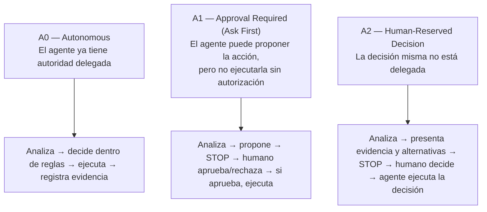

# Constitution — Semillero SOLID
### Reglas de gobierno persistentes del proyecto (Fase 1 de SDD)

---

## 1. Propósito y alcance de este documento

Este documento fija las reglas que **no cambian de un incremento a otro** y que gobiernan tanto a las personas del equipo como a los agentes de IA durante todo el desarrollo de la herramienta.

**Qué gobierna:** restricciones permanentes, el modelo de autoridad Humano-IA, las reglas de evidencia y trazabilidad, y las dos reglas transversales de proporcionalidad e intención/verificación.

**Qué NO gobierna** (y por tanto no debe añadirse aquí, aunque el tema surja en discusión):
- Requisitos funcionales y no funcionales de una funcionalidad específica → `spec.md`
- Drivers arquitectónicos, ASRs, alternativas de diseño, arquitectura → `architecture-drivers.md` y `plan.md`
- Tareas concretas de un incremento → `tasks.md`
- El flujo general de las 7 fases y sus artefactos → `proceso-sdd-semillero-solid.md` (este documento no lo repite)

Si una regla que se está por escribir aquí es específica de una funcionalidad o de una decisión de arquitectura, no pertenece a este documento.

---

## 2. Restricciones no negociables

Estas restricciones no dependen del incremento que se esté trabajando y no se renegocian informalmente tarea a tarea (revisarlas sí es posible, ver sección 10):

- El código fuente de los repositorios analizados no se envía a servicios de IA externos sin autorización explícita — coherente con el principio de privacidad del código analizado ya establecido en el contexto maestro del proyecto.
- Se respetan las licencias de código, datasets y modelos utilizados en cualquier experimento o componente.
- No se incorpora una dependencia crítica sin aprobación explícita (nivel **A1**, sección 5).
- Los resultados determinísticos (análisis estático, métricas, parsing) y las inferencias del LLM se mantienen diferenciados en todo momento — nunca se presentan con el mismo nivel de certeza ni se mezclan sin marcar cuál es cuál.

---

## 3. Principios invariantes

El proyecto opera bajo dos conjuntos de principios que este documento hereda y no repite en detalle:

- Los **7 principios generales de SDD** (qué y por qué preceden al cómo; la spec se versiona junto al producto; requisitos/diseño/tareas se mantienen separados; toda decisión es trazable; generar no equivale a verificar; guardrails persistentes; ninguna desviación se resuelve en silencio) — descritos en `proceso-sdd-semillero-solid.md`, sección 3.
- Los **principios del contexto maestro del proyecto** ya establecidos para SOLID Semillero: rigor técnico, evidencia verificable, reproducibilidad, transparencia metodológica, separación entre hechos e hipótesis, uso responsable de IA, privacidad del código analizado, explicabilidad, modularidad, mantenibilidad, trazabilidad de decisiones, evaluación crítica de resultados, no asumir que una respuesta de IA es correcta, no presentar un prototipo como producto validado.

Las secciones que siguen son la forma en que estos principios se vuelven **operativos** dentro del ciclo SDD — no los sustituyen.

---

## 4. Modelo de autoridad Human-in-the-Loop

La supervisión humana no es una fase adicional del proceso: opera de forma transversal en las 7 fases. La unidad de gobierno es **el tipo de decisión**, no la fase en la que ocurre — dentro de una misma fase pueden coexistir los tres niveles.

Se distinguen dos preguntas distintas, que no deben confundirse:

> **Autonomía de ejecución** — ¿puede el agente hacer esto por sí solo?
> **Autoridad de decisión** — ¿puede el agente decidir que esto es lo que debe hacerse?

Una vez que una decisión está autorizada, todo lo que se deriva mecánicamente de ella (generar código, actualizar tests, correr el pipeline) puede ejecutarse con autonomía completa — eso no equivale a que el agente haya tenido autoridad sobre la decisión original.

### Los tres niveles

| Nivel | Qué significa | Quién tiene la autoridad de decisión |
|---|---|---|
| **A0 — Autonomous** | El agente ejecuta dentro de límites ya aprobados, sin detenerse | El agente, dentro de reglas ya autorizadas |
| **A1 — Approval Required (Ask First)** | El agente puede elaborar y proponer una acción concreta, pero necesita autorización antes de ejecutarla | La autoridad de *ejecución* está condicionada; la propuesta puede ser del agente |
| **A2 — Human-Reserved Decision** | La decisión no está delegada al agente; este solo aporta análisis, evidencia y alternativas | La persona — el agente no debe presentar una alternativa como si ya fuera la decisión tomada |

La diferencia entre A1 y A2 **no** depende de cuántas alternativas se presenten — una decisión A1 puede traer varias opciones, y una A2 puede tener una sola alternativa razonable. Lo que cambia es si la autoridad de decidir pertenece al agente (condicionada a aprobación) o está reservada por completo a la persona.

---

## 5. Matriz de autoridad

Esta matriz clasifica tipos concretos de decisión. Se amplía cuando aparezca un tipo de decisión recurrente que no encaje claramente en ninguna fila existente (ver sección 11).

| Tipo de decisión | Nivel | El agente puede | La persona | Evidencia requerida |
|---|---|---|---|---|
| Corrección mecánica de formato o estilo | A0 | Ejecutar directamente | Supervisión posterior | Diff |
| Acción ya autorizada dentro de una tarea aprobada | A0 | Decidir y ejecutar | Supervisión posterior | Log de ejecución |
| Spec de una funcionalidad | A1 | Redactar y proponer | Aprobar o rechazar | `spec.md` con Clarify Loop resuelto |
| Nueva dependencia importante | A1 | Analizar y recomendar | Aprobar o rechazar | Análisis de impacto |
| Tarea implementada (Test Gate / Semantic Audit) | A1 | Ejecutar y reportar | Aceptar o rechazar | Pruebas + evidencia de conformidad con la spec |
| Cambio de alcance de un incremento | A2 | Analizar consecuencias, presentar alternativas | Decide | Impacto + alternativas consideradas |
| Cambio arquitectónico significativo | A2 | Presentar alternativas y trade-offs | Decide | ADR |
| Ambigüedad de requisito no resuelta en el Clarify Loop | A2 | Formular preguntas | Resuelve la intención | Decisión registrada en `spec.md` |
| Cambio a esta Constitution | A2 | Proponer y justificar el cambio | Decide | Versión anterior + justificación del cambio |
| Ratificar sin cambios una propuesta de arquitectura preexistente (resultado KEEP) | A2 | Presentar evidencia de que satisface los ASRs | Decide | Architecture Evaluation documentada |

---

## 6. Reglas de trazabilidad

- Toda tarea (`tasks.md`) debe poder rastrearse a un requisito concreto de `spec.md`.
- Toda ejecución de nivel A0 que se derive de una decisión A1 o A2 debe registrar de qué decisión proviene su autorización — la autonomía de ejecución no exime de dejar ese rastro.
- Todo ADR debe vincularse al ASR o a la ambigüedad que lo originó.
- Toda decisión de nivel A2 queda registrada por escrito (en `spec.md`, `plan.md` o un ADR, según corresponda) — una decisión reservada al humano que no queda escrita no puede distinguirse después de una decisión que nunca se tomó.

---

## 7. Reglas de evidencia y verificación

- Todo hallazgo (`Finding`) debe estar respaldado por evidencia trazable a elementos concretos del código analizado.
- Una salida del LLM no constituye, por sí sola, evidencia.
- Debe distinguirse siempre evidencia observada (resultados determinísticos: parsing, métricas, análisis estático) de interpretación o inferencia (generada por el LLM).
- Una propuesta de diseño o arquitectura preexistente no se considera válida por el solo hecho de existir. El resultado KEEP de Architecture Evaluation exige la misma evidencia trazable a los ASRs que MODIFY, ADD, DEFER o REMOVE — nunca es el resultado por defecto ante ausencia de objeción explícita.
- Todo resultado inferido por el LLM declara su nivel de incertidumbre o confianza de forma explícita.
- Generar no equivale a verificar: código y especificación se contrastan con pruebas, revisión y evidencia — nunca se da por bueno solo porque "compila" o porque el propio agente lo declara correcto.
- **Advertencia de weak oracle:** cuando el mismo agente que genera una implementación también genera las pruebas que la validan, el Semantic Audit debe verificar la lógica de las aserciones contra la especificación — no basta con que las pruebas estén en verde.

---

## 8. Regla de proporcionalidad

> El nivel de formalidad del proceso SDD debe ser proporcional al riesgo, impacto, complejidad y ambigüedad del cambio. Las siete fases constituyen el flujo de referencia, pero no todas requieren un artefacto independiente para cada modificación. Las fases pueden simplificarse o combinarse siempre que se preserve intención explícita, trazabilidad suficiente y verificación posterior.

Los niveles de riesgo (bajo / medio / alto) y sus ejemplos concretos están definidos en `proceso-sdd-semillero-solid.md`, sección 6.1 — esta Constitution no los repite.

---

## 9. Regla de intención y verificación

> Ningún cambio puede omitir la definición explícita de su intención ni la verificación de que el resultado corresponde con ella.

---

## 10. Gobierno del cambio

- Esta Constitution se revisa solo cuando cambian reglas de gobierno importantes — no se renegocia informalmente dentro de una tarea o conversación puntual.
- Todo cambio a este documento es una decisión de nivel **A2**: el agente puede analizar y proponer una redacción, pero la decisión de modificarla pertenece al equipo.
- Todo cambio queda registrado con: qué cambió, por qué, y qué versión anterior reemplaza.
- Un desacuerdo entre esta Constitution y una regla más específica de `spec.md` o `plan.md` se resuelve a favor de la Constitution, salvo que el cambio a la regla más específica haya sido aprobado explícitamente como una excepción documentada (ver sección 11).

---

## 11. Excepciones y escalamiento

- Ante un tipo de decisión no contemplado explícitamente en la matriz de autoridad (sección 5), se aplica por defecto el nivel **A2** hasta que se registre una clasificación explícita para ese tipo de decisión.
- Toda excepción a una regla de esta Constitution requiere justificación explícita y registro escrito — no se asume una excepción por omisión ni por precedente informal.
- Si una regla de esta Constitution bloquea de forma evidente un avance legítimo, se escala como decisión A2: el agente documenta el conflicto y las alternativas, y el equipo decide si ajusta la regla o si el caso concreto amerita una excepción registrada.

---

*Constitution — Semillero SOLID. Fase 1 del proceso SDD descrito en `proceso-sdd-semillero-solid.md`. Se carga como contexto persistente en Specify, Plan, Tasks, Implement, Test Gate/Semantic Audit y Drift Management.*
