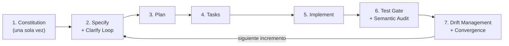
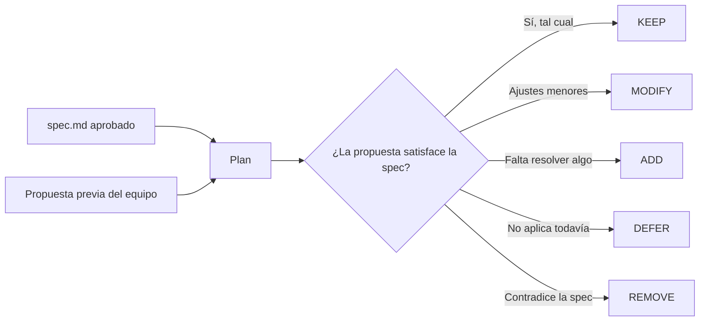
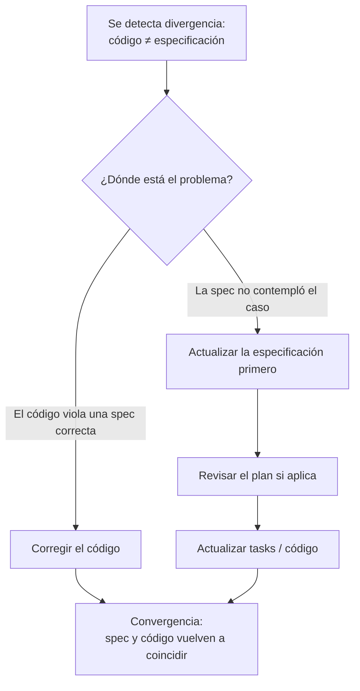
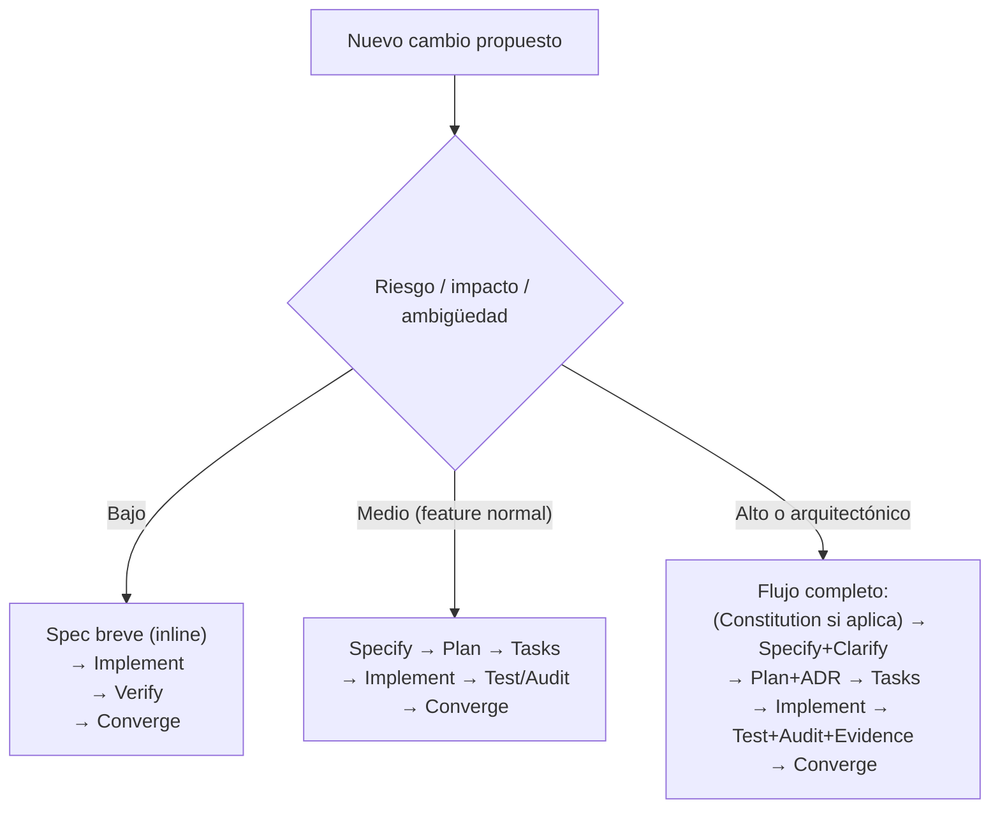

# Proceso SDD del Semillero SOLID
### Guía de referencia para el equipo de trabajo

---

## 1. Qué es este documento

Este documento describe **el proceso de trabajo** que el Semillero SOLID usará para construir la herramienta de análisis de deuda técnica, no el contenido técnico del producto. Es decir: aquí no se habla de SOLID, de LLMs locales, ni de arquitectura — eso vive en otros documentos (`constitution.md`, `spec.md`, `plan.md`). Este documento explica **cómo trabajamos**, y esa parte es completamente agnóstica: el mismo proceso serviría para construir cualquier otro sistema.

Está dirigido a cualquier persona del equipo que vaya a especificar una funcionalidad, revisar una arquitectura, ejecutar una tarea con un agente de IA, o auditar un resultado.

> **Estado de este documento:** versión propuesta para discusión y aprobación del equipo. Aún no ha sido presentado ni validado colectivamente.

---

## 2. Por qué no improvisamos ("vibe coding")

Cuando se delega la escritura de código a un agente de IA sin un proceso explícito, el agente completa con sus propias suposiciones todo lo que no quedó dicho. El resultado típico es deriva arquitectónica, decisiones no documentadas y código que "funciona" pero que nadie puede explicar por qué está construido así.

**Spec-Driven Development (SDD)** invierte ese orden: la especificación de la intención se escribe primero, se mantiene viva durante todo el desarrollo, y gobierna lo que el agente puede y no puede hacer.

> **Definición de trabajo propuesta para el proyecto:**
> Se propone que el proyecto adopte un enfoque *Spec-Driven Development*, spec-anchored, con supervisión humana constante (*Human-in-the-Loop*) y proporcional al riesgo. El flujo de referencia estaría compuesto por **Constitution, Specify, Plan, Tasks, Implement, Test Gate/Semantic Audit y Drift Management**. Estas fases representan responsabilidades del proceso, no necesariamente documentos ni ceremonias obligatorias para cada cambio. La profundidad y los artefactos usados se ajustarían al riesgo, impacto, complejidad y ambigüedad de cada modificación, manteniendo como requisitos mínimos: intención explícita, trazabilidad suficiente y verificación posterior.

---

## 3. Principios que gobiernan todo el proceso

Estos principios son válidos sin importar qué se esté construyendo:

1. **El qué y el porqué preceden al cómo.** No se diseña ni se implementa sin haber especificado la intención.
2. **La especificación se versiona junto al producto** — no es un documento de arranque que se abandona.
3. **Requisitos, diseño y tareas se mantienen separados**, para que la primera solución que sugiera el agente no se convierta accidentalmente en el requisito.
4. **Toda decisión importante debe poder rastrearse** hasta una necesidad o restricción concreta.
5. **Generar no es lo mismo que verificar.** Código y especificación se contrastan con pruebas, revisión y evidencia — nunca se da por bueno solo porque "compila" o porque el propio agente dice que está correcto.
6. **Las restricciones arquitectónicas estables, los estándares de calidad y las convenciones se codifican como reglas persistentes**, en lugar de depender de la memoria de cada conversación con el agente. (La arquitectura en su conjunto sigue siendo objeto de decisión y evolución en `plan.md`; aquí solo se fijan sus restricciones estables.)
7. **Una desviación detectada se resuelve explícitamente** — nunca se deja que código y especificación diverjan en silencio.

---

## 4. El flujo de las 7 fases

| Fase | Propósito | Artefacto principal | Pregunta para avanzar |
|---|---|---|---|
| 1. Constitution | Fijar las reglas que gobiernan a personas y agentes durante todo el proyecto | `constitution.md` | ¿Las reglas importantes son claras y no se contradicen? |
| 2. Specify | Definir qué construir, para quién, por qué y cómo se reconoce que funciona | `spec.md` | ¿La intención es suficientemente clara y verificable? |
| 3. Plan | Decidir cómo satisfacer la especificación | `plan.md` (arquitectura, alternativas, ADR cuando aplique) | ¿Hay una solución técnica razonable y trazable a la spec? |
| 4. Tasks | Convertir el plan en unidades implementables | `tasks.md` o tareas inline | ¿Existe un próximo incremento claro y verificable? |
| 5. Implement | Construir exclusivamente el incremento autorizado | Código + cambios asociados | ¿Se implementó completo el alcance acordado, y nada más? |
| 6. Test Gate / Semantic Audit | Demostrar que lo construido cumple la intención | Pruebas + evidencia | ¿Se cumple la spec, la constitution y los criterios de aceptación? |
| 7. Drift Management / Convergence | Resolver diferencias entre intención, diseño y producto | Actualización explícita de spec/plan/código | ¿Los artefactos vuelven a decir lo mismo? |

**Fase 1 se hace una sola vez** al inicio del proyecto (y se revisa solo cuando cambian reglas de gobierno importantes). **Las fases 2 a 7 constituyen el flujo de referencia para cada incremento.** De acuerdo con el principio de proporcionalidad (sección 6), algunas pueden resolverse de forma simplificada, combinada o inline cuando el riesgo y la complejidad del cambio no justifican artefactos separados — no se ejecutan siempre las siete de forma completa e independiente.

---

## 5. Detalle de cada fase

### 5.1 Constitution — las reglas persistentes del proyecto

Se define **antes** de especificar cualquier funcionalidad. Contiene los límites permanentes del proyecto: qué debe hacerse siempre, qué requiere aprobación humana explícita antes de proceder, y qué nunca debe hacerse. El agente de IA la recibe como contexto persistente en cada tarea. "Persistente" no significa inmutable: se revisa cuando cambian reglas de gobierno importantes, pero no se renegocia informalmente tarea a tarea.

### 5.2 Specify — qué y por qué, sin prescribir el cómo

Se define el problema, el objetivo, el alcance (y lo que queda explícitamente fuera de alcance), los requisitos, los criterios de aceptación y los casos límite. Aquí opera el **Clarify Loop**: antes de pasar a diseño, se identifican ambigüedades, casos borde y requisitos faltantes — sin proponer todavía ninguna solución técnica.

La condición para avanzar no es eliminar toda incertidumbre, sino que no queden **ambigüedades críticas** que impidan decidir el diseño.

### 5.3 Plan — el cómo, apoyado en lo que ya existe

Con la especificación aprobada, se decide la solución técnica: arquitectura, stack, modelo de datos, contratos de API. Cualquier propuesta de diseño previa del equipo entra aquí **como insumo a evaluar**, no como restricción ya decidida:

Todo cambio arquitectónico relevante que surja aquí queda documentado como decisión explícita (ADR).

### 5.4 Tasks — trabajo ejecutable

El plan se descompone en unidades pequeñas, trazables a un requisito, con un resultado verificable. No se fijan reglas rígidas de tiempo o de número de archivos como norma universal; el criterio es más simple: **una tarea debe poder implementarse y verificarse sin perder el contexto**.

### 5.5 Implement — el agente ejecuta, la persona guía

El agente trabaja **una tarea a la vez**, con contexto explícito (Constitution + Spec + Plan + la tarea actual) — nunca con una instrucción abierta tipo "construye el sistema". Este es el cambio de rol central de SDD: la persona deja de ser quien escribe cada línea y pasa a ser **arquitecto y guardián de la intención**; el agente es quien ejecuta.

### 5.6 Test Gate / Semantic Audit — no basta con que compile

Se verifica en dos niveles:

- **Bloqueante (debe pasar siempre):** cumplimiento de la especificación, cumplimiento de la Constitution, pruebas existentes y en verde, evidencia de que el hallazgo o comportamiento corresponde a lo especificado.
- **Revisión de calidad (no bloqueante por defecto):** legibilidad, rendimiento, mantenibilidad y buenas prácticas generales. Estos criterios pasan a ser **bloqueantes** cuando la Constitution, la Spec o un quality gate establezcan explícitamente un umbral obligatorio — por ejemplo, un límite de complejidad, un requisito de seguridad, o un NFR de rendimiento.

> ⚠️ **Cuidado con los "weak oracles".** Cuando el mismo agente que genera el código también genera las pruebas que lo validan, existe el riesgo de que las pruebas confirmen lo que el código *ya hace* en vez de lo que *debería hacer* según la spec. La auditoría debe verificar la lógica de las aserciones, no solo que las pruebas estén en verde.

### 5.7 Drift Management / Convergence — cuando algo diverge

**Regla de oro:** si el código está mal, se corrige el código. Si la especificación estaba incompleta, **nunca se parcha el código directamente** — primero se actualiza la especificación, y solo después se regenera o ajusta el código a partir de la nueva verdad.

Esta fase no requiere una ceremonia grande; puede resolverse como parte del cierre de una tarea o de un *pull request*.

---

## 6. Principio de proporcionalidad

No todo cambio necesita las 7 fases completas con un documento independiente cada una. El nivel de formalidad debe ser proporcional al **riesgo, impacto, complejidad y ambigüedad** del cambio.

### 6.1 ¿Cómo sabemos si un cambio es bajo, medio o alto?

No se usa una fórmula; se orienta con ejemplos:

| Nivel | Ejemplos |
|---|---|
| **Bajo** | Corrección textual, cambio cosmético, refactor local sin modificar comportamiento |
| **Medio** | Nueva funcionalidad, nuevo endpoint, cambio de comportamiento existente |
| **Alto** | Modificación arquitectónica, cambio de esquema de datos, seguridad, cambio de contrato público, cambio de una regla central de negocio, cambio metodológico que afecte resultados experimentales |

**Regla de proporcionalidad (para incluir en `constitution.md`):**
> El nivel de formalidad del proceso SDD debe ser proporcional al riesgo, impacto, complejidad y ambigüedad del cambio. Las siete fases constituyen el flujo de referencia, pero no todas requieren un artefacto independiente para cada modificación. Las fases pueden simplificarse o combinarse siempre que se preserve intención explícita, trazabilidad suficiente y verificación posterior.

**Regla de intención y verificación (para incluir en `constitution.md`):**
> Ningún cambio puede omitir la definición explícita de su intención ni la verificación de que el resultado corresponde con ella.

Estas dos reglas evitan los dos extremos: improvisar sin especificación ("vibe coding") y convertir SDD en burocracia documental.

---

## 7. Autoridad de aprobación (Human-in-the-Loop)

"Human-in-the-Loop" no significa "alguien miró la respuesta". La supervisión humana no es una fase adicional del proceso: opera de forma transversal en las 7 fases, y su alcance depende del tipo de decisión, no de en qué fase ocurre.

El modelo de autoridad (niveles A0/Autonomous, A1/Approval Required, A2/Human-Reserved Decision) y la matriz que clasifica qué nivel corresponde a cada tipo de decisión están definidos en `constitution.md` — este documento no los repite, para mantener una sola fuente normativa.

---

## 8. Artefactos del proceso — dónde vive cada cosa

| Artefacto | Se crea en | Frecuencia | Contenido |
|---|---|---|---|
| `constitution.md` | Fase 1 | Una vez (se revisa solo ante cambios de gobierno) | Reglas persistentes, límites del agente, principios de calidad y evidencia |
| `spec.md` | Fase 2 | Por incremento (o inline si es un cambio pequeño) | Problema, alcance, requisitos, criterios de aceptación, preguntas abiertas |
| `plan.md` | Fase 3 | Cuando el incremento lo justifique | Arquitectura, alternativas consideradas, contratos, modelo de datos |
| `tasks.md` | Fase 4 | Cuando el incremento lo justifique | Lista de tareas trazables a requisitos |
| `decisions/` (ADR) | Fase 3 o 7 | Solo decisiones relevantes | Decisión, alternativas, justificación |
| Evidencia de verificación | Fase 6 | Por incremento | Resultados de pruebas, contraste código↔spec |

---

## 9. Qué NO es este proceso

- **No es** escribir documentación exhaustiva antes de cada línea de código — la proporcionalidad existe precisamente para evitar eso.
- **No es** un sustituto de las pruebas automatizadas ni de la revisión de código — SDD exige *más* capacidad de verificación, no menos.
- **No es** una garantía de que el agente no se equivoque — es un proceso para detectar y corregir esas equivocaciones antes de que se acumulen como deuda técnica no documentada (una ironía que, dado el tema de este proyecto, conviene tener presente).
- **No es** una fase por cada micro-cambio — commits triviales pueden resolverse con una especificación breve inline, sin generar los cinco artefactos completos.

---

## 10. Glosario breve

| Término | Significado en este proceso |
|---|---|
| **Spec-anchored** | La especificación se mantiene sincronizada con el sistema durante toda su evolución (no es un documento que se escribe una vez y se abandona) |
| **Human-in-the-Loop (HITL)** | La persona aprueba las decisiones de alto impacto; el agente ejecuta dentro de los límites definidos |
| **Drift** | Divergencia entre lo que dice la especificación y lo que realmente hace el código |
| **Semantic Audit** | Revisión de si el comportamiento generado corresponde realmente al requisito, no solo si el código compila o pasa pruebas superficiales |
| **Weak oracle** | Una prueba que confirma lo que el código ya hace, en vez de verificar lo que debería hacer según la especificación |
| **ADR** | *Architecture Decision Record* — registro breve de una decisión de diseño relevante, sus alternativas y su justificación |

---

## 11. Estado de este proceso y próximos pasos

Este flujo de fases **se propone** como referencia oficial del proyecto, pendiente de revisión y aprobación del equipo. Una vez aprobado, el siguiente paso es empezar a llenar sus artefactos, comenzando por `constitution.md`.

Dos puntos quedan señalados como pendientes de resolver **dentro del contenido** de `constitution.md` (no son defectos de este proceso, sino decisiones específicas del dominio del proyecto que este documento, por ser agnóstico, no debe anticipar):

- Qué constituye evidencia suficiente para un hallazgo cuyo juicio de fondo no tiene un veredicto binario verificable.
- Si la evidencia de verificación (fase 6) se mantendrá como artefacto persistente (`evidence.md`, actualizado en CI) o como registro efímero por incremento.

---

*Documento de proceso — Semillero SOLID. Basado en la revisión del estado de la práctica de Spec-Driven Development (2025–2026) y en ejercicios prácticos de referencia sobre el flujo Constitution→Specify→Plan→Tasks→Implement→Test Gate→Drift Management.*
